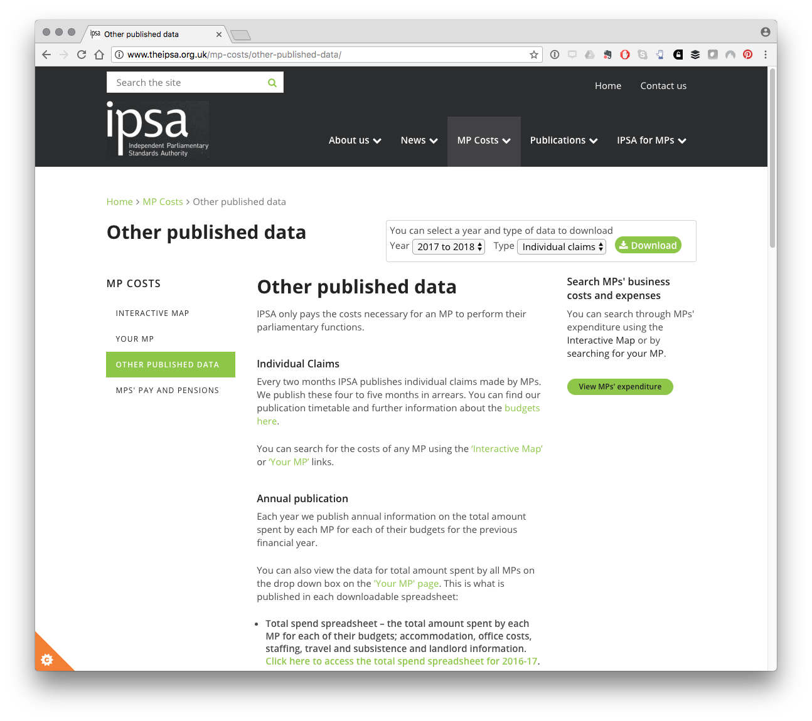

[](http://www.repostatus.org/#wip)
[](http://choosealicense.com/licenses/mit/)
 
---
 
[](https://cran.r-project.org/)
[](https://cran.r-project.org/package=ipsar)
[](commits/master)
 
---
 
[)`-yellowgreen.svg)](/commits/master)

```{r setup, include=FALSE}
knitr::opts_chunk$set(echo = TRUE)
```

## The ipsar Package

This R data package provides access to the expenses claim data for UK Members of Parliament from the [Independent Parliamentary Standards Authority (IPSA)](http://www.theipsa.org.uk/). 

`ipsar` aims to do two things:

1. Make MPs expenses data available in one table.
2. Build a bridge between the IPSA expenses data and the [`data.parliament`](http://data.parliament.uk/membersdataplatform/memberquery.aspx) Members' Name Data Platform through the [`mnis`](https://github.com/evanodell/mnis) R package by [Evan Odell](https://github.com/evanodell). 

The package provides access to MPs raw expenses data for over 1.4 million expenses claims between May 2010 and the end of March 2018 (latest data). The package also links the IPSA expenses claims data with the `data.parliament Members' Name Data Platform` API service through MP standard IDs (member_id). The package aims to assist researchers interested in combining MPs expenses data with `data.parliament` data. 

`ipsar` is an independent data package based on public data and is not associated with, supported or endorsed by the Independent Parliamentary Standards Authority (IPSA). 

## The IPSA Expenses Data

The Independent Parliamentary Standards Authority has made data on MPs expenses available since May the 7th 2010, the day after the 2010 General Election. No data is available prior to May 7th 2010. IPSA expenses data is organised by UK financial years (1st of April to 31st of March). 

Raw expenses data for individual members is presently available as a set of .csv downloads from the IPSA website at [http://www.theipsa.org.uk/mp-costs/other-published-data/](http://www.theipsa.org.uk/mp-costs/other-published-data/) and by selecting the dropdown for Individual Claims for the financial year. The image below displays the drop down for accessing the raw individual financial year records from [IPSA](http://www.theipsa.org.uk/mp-costs/other-published-data/). For information on new releases follow IPSA on Twitter at [ipsaUK](https://twitter.com/ipsaUK).

```{r fig.align='center'}

```

For individual constituencies you can use the search tool or map on the [IPSA website](http://www.theipsa.org.uk/mp-costs/interactive-map/). A website called [MP Expenses Info](http://www.mpsexpenses.info/#!/search) also provides access to MP expenses data by individual MPs and in [summary form](http://www.mpsexpenses.info/#!/all) but does not provide access to the underlying raw data. If you are just looking for information about your MP or a quick overview then these sites are probably a better source of information. 

New data is made available every two months and has a delay of three months.^[see [http://www.theipsa.org.uk/mp-costs/](http://www.theipsa.org.uk/mp-costs/)] At the time of writing in early September 2018, the complete data for the 2017 to 2018 financial year had recently become available. The package thus provides time series data for financial years from May 2010 to the end of March 2018. 

## Installing ipsar

ipsar is not on CRAN as it contains some large files but can be installed from Github. To install it you will need devtools.

```{r eval=FALSE}
install.packages("devtools")
```

```{r eval=FALSE}
devtools::install_github("poldham/ipsar")
```

```{r load_library}
library(ipsar)
```

## ipsar functions

ipsar contains two simple convenience functions for loading the data into your global environment. 

```{r}
library(ipsar)
ipsar::load_ipsa()
```

```{r cache=TRUE, echo=FALSE}
head(ipsa) %>% knitr::kable()
```

This might take a few moments as it is a compressed file. 

The concordance table between IPSA and `data.parliament` for MPs and former MPs is called `ipsa_commons` and can be loaded using:

```{r}
ipsar::load_ipsa_commons()
```

```{r head_ipsa_commons, echo=FALSE, cache=TRUE}
head(ipsa_commons) %>% knitr::kable()
```

This table covers 950 existing and former Members of Parliament. It is important to know that:

- `display_as` is the preferred `data.parliament` system name and is duplicated as `dp_name`
- `mps_name` is the name used by IPSA for recording MPs expenses and is duplicated as `ipsa_name`
- `commons_short` is the name used for matching between the two sources as described in the [vignette]()

The key field for the `data.parliament` service is the `member_id`. 

## Historic Data

An effort has been made to preserve the records for MPs who leave the House of Commons and those who move to the House of Lords to assist with historical research. This information is recorded in the supplementary column `current_role` as either MP, Lords or Ex. For everyday use you will normally want to drop the Ex and Lords entries. To filter only to current MPs in the `ipsa_commons` concordance table use:

```{r message=FALSE}
library(tidyverse)
ipsa_commons %>% 
  dplyr::filter(current_role == "MP") %>% 
  head() %>% 
  knitr::kable()
```

Or for expenses claims use:

```{r}
ipsa %>%
  dplyr::filter(current_role == "MP") %>% 
  head() %>% 
  knitr::kable()
```

## Data Cleaning and Name Matching with Data.Parliament

Data cleaning and name matching is described in detail in the [vignette](). Here is a quick summary.

The IPSA data frame has undergone minimal cleaning:

- column names converted to lower case and spaces and punctuation removed with `janitor::clean_names()`
- date column converted from dd/mm/yyyy to yyyy-mm-dd with `lubridate::ymd()`.
- columns 14:19 converted to numeric ("nights", "mileage", "amount_claimed", "amount_paid", "amount_not_paid", "amount_repaid")
- Some names appear in more than one form or have changed over time in the ipsa records. These records are left as is with details provided in the vignette. 

*Linking with the Members' Name Data Platform*

The Members' Name Data Platform (formerly the Member Name Information Service (mnis)) operated by `data.parliament` provides API access to a range of name based data. The most important of these is the member identifier number (`member_id`) as the key to data within the wider `data.parliament` services. This is not presently included with IPSA data and therefore prevents easy linking with the `data.parliament` service. 

The `ipsa` table now includes `member_id`. A concordance table for the ipsa data is provided as `ipsa_commons`. 

```{r}
ipsar::load_ipsa_commons()
```

```{r}
head(ipsa_commons) %>% 
  knitr::kable()
```

Matching ipsa and data.parliament data involved three main issues

1. The `ipsa` `mps_name` field does not exactly match with the name fields in the `data.parliament` data, notably the `display_name` field in `data.parliament`.  
2. At each election MPs leave the House. Where an MP leaves the House entirely this is recorded in the mnis `house_end` column. Where an MP continues in post the `house_end` data is NA (Not Available). Where an MP moves to the House of Lords, their history as an MP effectively disappears in the `data.parliament` data and their name changes in the record (e.g. former Labour MP David Blunkett became Lord Blunkett). This means that their name no longer matches with the IPSA name. The package seeks to preserve the link to assist with historical research.
3. MPs may leave the house between elections as a result of by-electioons. New MPs may not appear for some months in IPSA data. 

The cleaning steps involved in harmonizing the datasets are covered in detail in the package [vignette]().

*The current_role column*

To enable historical research a column `current_role` has been added. This involves allocating members to three categories:

- MP
- Lords
- Ex

Where a former MP has moved to the Lords they are recorded as Lords even though they are no longer covered by the IPSA system (because IPSA only deals with MPs expenses claims). A summary of these entries can be seen below. 

```{r}
library(tidyverse)
ipsa_commons %>% 
  count(., current_role) %>% 
  head() %>% 
  knitr::kable()
```

This produces the expected 650 MPs at the time of writing on the 2018-09-03. 

The actual expenses data consisting of over 1.4 million records is presented as is. Note that the category, expense_type, short_description and details columns are likely to require significant clean up to arrive at consistent results. In addition attention is drawn to the need to review the `amount_claimed`, `amount_paid`, `amount_not_paid` and `amount_repaid` columns when exploring MPs expenses to avoid under or overcounting.  

## Disclaimer and Licensing Information

The `ipsar` package has been developed independently from the Independent Parliamentary Standards Authority (IPSA) using data made publicly available by IPSA in fulfilment of its mandate from the UK Parliament. As noted above `ipsar` is an independent data package based on public data and is not associated with, supported or endorsed by the Independent Parliamentary Standards Authority (IPSA). The `ipsar` package is provided without warranty. Members' Name Data Platform information (MNIS) data from `data.parliament` is made available under the [Open Parliament Licence](https://www.parliament.uk/site-information/copyright-parliament/open-parliament-licence/). 

Please notify the package author of corrections at [https://github.com/poldham/ipsar/issues](https://github.com/poldham/ipsar/issues)
